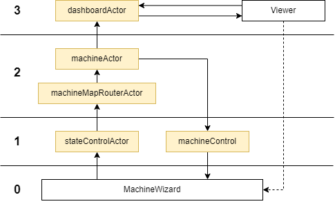
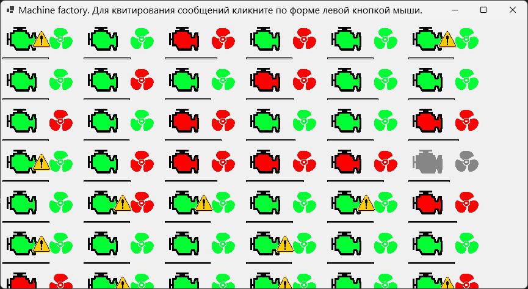

# MachineFactory  
MachineFactory это программа, моделирующая работу автоматизированной системы управления технологическим процессом (АСУТП). Она имитирует управление фабрикой, состоящей из _MACHINE_COUNT_ (_MACHINE_COUNT_ - здесь и далее таким образом будут указываться ссылки на параметры из Config программы) машин.  
Машина состоит из двигателя и вентилятора. Смысл машины - обеспечить работу двигателя, выполняющего некоторую положительную нагрузку. В процессе работы двигателя подымается температура машины, а работа вентилятора уменьшает температуру машины. Если температура машина достигает некоторого критического уровня, то её следует выключить. При выключении машины на нее действует внешняя среда, которая понижает температуру машины. Формально модель машины может быть представлена следующим образом:  
$$t_{i+1} = t_i + e_{on/off}*t_e-f_{on/off}*t_f-(1-e_{on/off})*(1-f_{on/off})*t_{env},$$  
где   
$i {\in} N$ - шаг моделирования,  
$t_{i+1}$ - температура машины на следующем шаге,  
$t_i$ - температура машины на текущем шаге,  
$e_{on/off} {\in} [0,1]$ - указывает включен двигатель (1) или нет (0),  
$t_e$ - изменение температуры, связанное с работой двигателя,  
$f_{on/off} {\in} [0,1]$ - указывает включен вентилятор (1) или нет (0),  
$t_f$ - изменение температуры, связанное с работой вентилятора,  
$t_{env}$ - изменение температуры, связанное с внешней средой.  
Создание машин происходит в начале работы программы и каждые _MACHINE_COUNT_ миллисекунд происходит расчет состояний машин и передача необходимых сообщений. При создании каждой машины случайным образом выбирается значение $t_e$ в диапазоне [_TEMPERATURE_CHANGE_ENGINE_MIN_, _TEMPERATURE_CHANGE_ENGINE_MAX_], $t_f$ в диапазоне [_TEMPERATURE_CHANGE_FAN_MIN_, _TEMPERATURE_CHANGE_FAN_MAX_], $t_{env}$ в диапазоне [_TEMPERATURE_CHANGE_ENV_MIN_, _TEMPERATURE_CHANGE_ENV_MAX_]. Начальное значение температуры выбирается случайным образом в диапазоне [0, _MACHINE_START_TEMPERATURE_MAX_].  
Помимо этого с вероятностью _PDROP_MACHINE_STATE_MESSAGE_ происходит выбор машины для блокирования передачи ее сообщений на случайно выбранное количество шагов моделирования в диапазоне  [_DROP_MACHINE_INTERVAL_MIN_, _DROP_MACHINE_INTERVAL_MAX_]. Также с вероятностью _PDROP_COMMANG_MESSAGE_ не передаются команды машине.  
  
# Модель управления  
Модель управления состоит из следующих правил:  
- Если температура ниже 50 градусов необходимо включить двигатель
- Если температура выше 75 градусов необходимо включить вентилятор
- Если температура выше 95 градусов необходимо выключить двигатель и вентилятор

# Архитектура решения  
Архитектура решения представлена на следующей диаграмме  

В программе передача сообщений происходит за счет Akka.Net. На диаграмме цветными прямоугольниками и названием, которое в конце содержит слово Actor обозначены акторы Akka.net. Другие блоки являются классами реализующие матмодель и обеспечивающие простейшее графическое отображение работы программы.  
Архитектурно программа разделена на четыре логических уровня:
- 0 - уровень аппаратуры. На этом уровне производиться моделирование работы физических устройств.
- 1 - уровень регистрации данных и управляющих сигналов. На нем происходит сохранение и первичное преобразование "сырых" данных. В данной реализации уровень упрощен только для первичного преобразования данных.
- 2 - уровень автоматического управления. На нем принимаются решения о выполнении необходимых действий.
- 3 - уровень отображения информации. Блок Viewer имеет связь с блоком MachineWizard, что в реальных системах не допускается. Эта связь должна попадать на уровень 1, но так как упрощена реализация этого уровня (уровня 1) используется такая  реализации взаимодействия.  
---
#### _* MachineFactory не является полноценным решением АСУТП. Поэтому некоторые вопросы связанные с надежностью и безопасностью управления в нем не рассматриваются._  
---  
# Графическое отображение работы программы  
  
Форма программы показывает состояние каждой машины. Машины располагаются на форме с лева на право и с верху вниз в соответствии со своими идентификационными номерами. Наличие пустого места в отображении машины говорит о том что от этой машины не было получено ни одно зафиксированное сообщение. Такое бывает обычно в начале работы программы, когда выбирается машина для блокировки передачи сообщений.  
Информация о состоянии машины заключается в отображении пиктограммы двигателя затем пиктограммы вентилятора и, возможно, значка предупреждения. Пиктограммы двигателя и вентилятора бывают трех цветов:
- зеленый - говорит о том, что двигатель/вентилятор включён и работает;
- красный - говорит о том, что двигатель/вентилятор выключен и не работает;
- серый - говорит о том, что от данной машины не приходили сообщение большее _FREEZ_MACHINE_INTE_ времени моделирования.  

Значок предупреждения появляется тогда, когда фиксируется ситуации непрохождения управляющей команды в машину. Это происходит с вероятностью _PDROP_COMMANG_MESSAGE_. Чтобы убрать значки предупреждения необходимо нажать левую кнопку мыши на форме программы, как указано в области названия формы.  
Для каждой машины под пиктограммами указывается полоса температуры этой машины. Температура берется непосредственно с 0 уровня и отображается всегда. 

